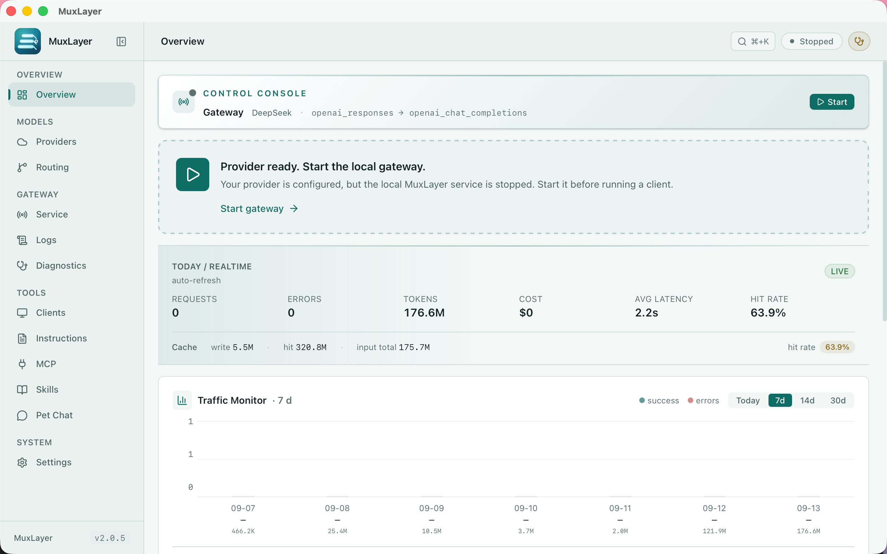

<p align="center">
  
</p>

<h1 align="center">MuxLayer</h1>

<p align="center">
  <b>The local model control layer for coding agents.</b><br>
  Use Codex, Claude Code, Gemini CLI, and OpenCode with the models you actually want.
</p>

<p align="center">
  Codex · Claude Code · Gemini CLI · OpenCode · Kimi CLI · Grok Build · DeepSeek Harness<br>
  ↓<br>
  <b>MuxLayer</b><br>
  ↓<br>
  DeepSeek · Kimi · MiMo · OpenAI · Anthropic · OpenRouter · OrcaRouter · Ollama · 25+ model providers
</p>

<p align="center">
  <a href="https://github.com/dengmengmian/muxlayer/releases"></a>
  <a href="https://github.com/dengmengmian/muxlayer/stargazers"></a>
  <a href="https://github.com/dengmengmian/muxlayer/releases"></a>
  <a href="./LICENSE"></a>
</p>

<p align="center">
  <a href="./README_ZH.md">中文</a> · <a href="https://github.com/dengmengmian/muxlayer/releases">Download</a> · <a href="#quick-start">Quick Start</a> · <a href="./docs/full-reference.md">Full Reference</a> · <a href="https://github.com/dengmengmian/muxlayer/discussions">💬 Discussions</a>
</p>

<p align="center">
  
</p>

MuxLayer is a local gateway for AI coding workflows. Requests enter through one controlled endpoint, then MuxLayer routes, converts, passes through, fails over, and records what happened.

## Why MuxLayer

- **Keep your clients:** Continue using Codex, Claude Code, Gemini CLI, OpenCode, and AtomCode with one-click config restore.
- **Choose the model path:** Route each request to the provider and model you want, with protocol conversion when needed.
- **See every request:** Inspect route decisions, payload diffs, upstream errors, tokens, cost, latency, and failover locally.

MuxLayer is not a hosted API reseller or a generic proxy. It is a local control layer between your coding agents and the model APIs they use.

## Quick Start

1. [Download MuxLayer](https://github.com/dengmengmian/muxlayer/releases) and open it.
2. Open **Quick Setup** or **Providers**, then paste a provider API key.
3. Start the gateway. The default endpoint is `http://127.0.0.1:9090`.
4. Open **Clients** and apply the Codex, Claude Code, OpenCode, Gemini CLI, or AtomCode configuration.

Send a test request, then open **Logs** to see the selected provider, model, route, status, and latency. The original client configuration can be restored at any time.

## What it handles

| Capability | What it gives you |
|---|---|
| Protocol conversion | Responses, Chat Completions, and Anthropic Messages can meet the upstream protocol they need. |
| Routing and failover | Select providers by route profile, conditions, health, cooldown, and fallback order. |
| Request tracing | Compare raw and converted payloads, route decisions, upstream status, latency, tokens, and cost. |
| Session affinity | Keep multi-turn conversations on the provider that started them, unless an override is required. |
| Local models and budgets | Discover Ollama / LM Studio endpoints and optionally gate daily spend. |

## Screenshots



## Supported clients and providers

**Clients:** Codex · Claude Code · Gemini CLI · OpenCode · AtomCode · Kimi CLI · Grok Build · DeepSeek Harness · Cursor / Continue / Cline

**Providers:** OpenAI · Anthropic · DeepSeek · Kimi · MiMo · Gemini · OpenRouter · OrcaRouter · Groq · Mistral · Ollama · LM Studio · and 25+ model providers.

See the [full provider compatibility matrix](./docs/full-reference.md#supported-providers) and the [usage guides](./docs/full-reference.md#usage-guide).

<details>
<summary>All supported providers</summary>

<!-- PROVIDER_CATALOG_TABLE:START -->
| Provider | Type | Native Protocols | Provider-Specific Handling |
|---|---|---|---|
| Xiaomi MiMo | `mimo` | Chat + Anthropic | Multi-turn `reasoning_content` round-trip, region-aware `tp-*` host auto-routing, temperature strip in thinking mode, tool_choice non-auto strip, omni web_search strip, web_search builtin gated by matrix, Web Search Plugin auto-degrade / retry |
| DeepSeek | `deepseek` | Chat + Anthropic | Vision model preserves image inputs; text-only models strip images with an explicit notice; DeepSeek V4 thinking history reasoning backfill, schema cleaning, message reordering |
| Anthropic (Claude) | `anthropic` | Anthropic | `tool_use`/`tool_result`, `input_schema`, thinking budget, native cache_control |
| GitHub Copilot | `copilot` | Chat + Anthropic | GitHub token → Copilot bearer exchange, `x-initiator` billing classification, Claude model dash→dot normalization |
| OpenAI | `openai` | Chat + Responses | None (Responses passthrough or Chat conversion) |
| Google Gemini | `google_gemini` | Chat | None |
| Kimi / Moonshot | `kimi` | Chat + Anthropic | `web_search` → `builtin_function`/`$web_search`; K3 uses `reasoning_effort:max` (no K2 `thinking` param); coding models keep thinking on/off control |
| MiniMax | `minimax` | Chat | Strip reasoning_effort / response_format, `<think>` extraction |
| GLM (Zhipu) | `glm` | Chat | Generic |
| DashScope (Qwen) | `dashscope` | Chat | Generic |
| SiliconFlow | `siliconflow` | Chat | Generic |
| Volcengine (Doubao) | `volcengine` | Chat | Generic |
| Baichuan | `baichuan` | Chat | Generic |
| StepFun | `stepfun` | Chat | Generic |
| SenseNova | `sensenova` | Chat | Drops null strict / response_format / non-function tools, merges system messages |
| Yi (01.AI) | `yi` | Chat | Generic |
| ModelScope | `modelscope` | Chat | Generic |
| xAI (Grok) | `xai` | Chat | Generic |
| Mistral | `mistral` | Chat | Generic |
| Groq | `groq` | Chat | Generic |
| Together | `together` | Chat | Generic |
| Fireworks | `fireworks` | Chat | Generic |
| Cerebras | `cerebras` | Chat | Generic |
| Perplexity | `perplexity` | Chat | Generic |
| Cohere | `cohere` | Chat | Generic |
| OpenRouter | `openrouter` | Chat | None |
| OrcaRouter | `orcarouter` | Chat | None |
| Custom | `custom_openai_compatible` | Chat | None (set Base URL yourself) |
<!-- PROVIDER_CATALOG_TABLE:END -->

</details>

### OrcaRouter

OrcaRouter is a first-class provider, not a custom endpoint you configure by hand.

- Base URL `https://api.orcarouter.ai/v1` is filled in for you.
- Keys starting with `sk-orca-` are detected on paste — Quick Add shows `Detected: OrcaRouter`.
- The model list is fetched live from OrcaRouter, so MuxLayer never pins a stale copy.
- `orcarouter/auto` is the default model: OrcaRouter picks the cheapest capable model per request.

No account yet? [Get an OrcaRouter API key](https://www.orcarouter.ai/ref/ref_01f91b655d7975ab01ae) — referral link, MuxLayer receives a share of usage from signups through it.

## Install

| Platform | Package |
|---|---|
| macOS Apple Silicon | [MuxLayer 2.0.6](https://github.com/dengmengmian/muxlayer/releases/download/v2.0.6/MuxLayer_2.0.6_aarch64.dmg) |
| macOS Intel | [MuxLayer 2.0.6](https://github.com/dengmengmian/muxlayer/releases/download/v2.0.6/MuxLayer_2.0.6_x64.dmg) |
| Windows 10 / 11 | [MuxLayer 2.0.6](https://github.com/dengmengmian/muxlayer/releases/download/v2.0.6/MuxLayer_2.0.6_x64-setup.exe) |
| Debian / Ubuntu | [MuxLayer 2.0.6](https://github.com/dengmengmian/muxlayer/releases/download/v2.0.6/MuxLayer_2.0.6_amd64.deb) |
| Other Linux distros | [MuxLayer 2.0.6](https://github.com/dengmengmian/muxlayer/releases/download/v2.0.6/MuxLayer_2.0.6_amd64.AppImage) |

On macOS:

```bash
brew install --cask dengmengmian/tap/muxlayer
```

**Windows:** Builds are currently unsigned, so SmartScreen may warn on first install. See the [installation and build notes](./docs/full-reference.md#installation--build).

Existing installations using the legacy `agentgate` cask remain supported and continue receiving the MuxLayer app. New installations should use `muxlayer`.

## Documentation

- [Full reference](./docs/full-reference.md)
- [Codex Desktop with third-party APIs and plugins](./docs/use-codex-desktop-with-third-party-api-and-plugins.md)
- [Codex + DeepSeek](./docs/use-codex-with-deepseek.md)
- [Codex + Xiaomi MiMo](./docs/use-codex-with-mimo.md)
- [Claude Code + DeepSeek](./docs/use-claude-code-with-deepseek.md)
- [Claude Code + GitHub Copilot](./docs/use-claude-code-with-github-copilot.md)
- [Gemini CLI](./docs/use-gemini-cli-with-muxlayer.md)
- [OpenCode](./docs/use-opencode-with-muxlayer.md)
- [Local models](./docs/use-local-models-with-muxlayer.md)

## Open-source toolkit

MuxLayer is part of a small AI developer toolkit:

- [CodeLeveler](https://github.com/dengmengmian/CodeLeveler) — inspect, edit, run, and verify code in the terminal.
- [ReviewGate](https://github.com/dengmengmian/ReviewGate) — review code changes and surface high-confidence issues.

## Development

```bash
pnpm install
pnpm tauri dev
```

```bash
pnpm brand:check
pnpm test:run
pnpm build
```

## Community

- Questions and setup help: [Discussions](https://github.com/dengmengmian/muxlayer/discussions)
- Bugs and provider requests: [Issues](https://github.com/dengmengmian/muxlayer/issues)
- Contributing: [CONTRIBUTING.md](./CONTRIBUTING.md)

## Compatibility

MuxLayer was formerly AgentGate. Existing desktop update identity, data directories, and legacy headless names remain compatible; see the [brand migration plan](./docs/brand-migration.md).

## License

MIT
