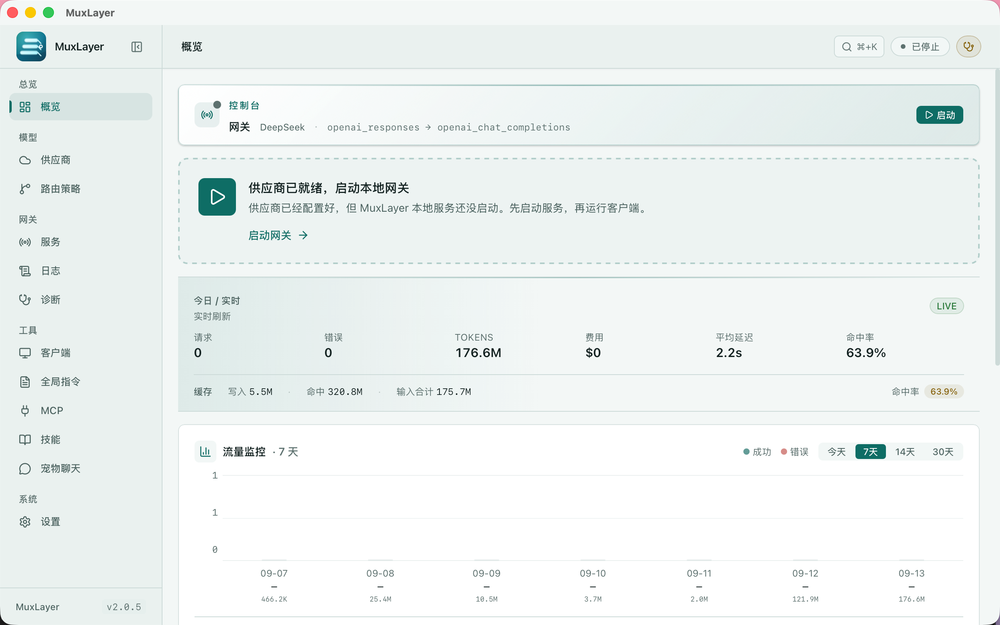

<p align="center">
  
</p>

<h1 align="center">MuxLayer</h1>

<p align="center">
  <b>Coding Agent 的本地模型控制层。</b><br>
  用 Codex、Claude Code、Gemini CLI 和 OpenCode，连接你真正想用的模型。
</p>

<p align="center">
  Codex · Claude Code · Gemini CLI · OpenCode · Kimi CLI · Grok Build · DeepSeek Harness<br>
  ↓<br>
  <b>MuxLayer</b><br>
  ↓<br>
  DeepSeek · Kimi · MiMo · OpenAI · Anthropic · OpenRouter · OrcaRouter · Ollama · 25+ 家模型供应商
</p>

<p align="center">
  <a href="https://github.com/dengmengmian/muxlayer/releases"></a>
  <a href="https://github.com/dengmengmian/muxlayer/stargazers"></a>
  <a href="https://github.com/dengmengmian/muxlayer/releases"></a>
  <a href="./LICENSE"></a>
</p>

<p align="center">
  <a href="./README.md">English</a> · <a href="https://github.com/dengmengmian/muxlayer/releases">下载安装</a> · <a href="#快速开始">快速开始</a> · <a href="./docs/full-reference-zh.md">完整参考</a> · <a href="https://github.com/dengmengmian/muxlayer/discussions">💬 社区讨论</a>
</p>

<p align="center">
  
</p>

MuxLayer 是 AI 编程工作流的本地网关。请求先进入一个受控入口，再由 MuxLayer 完成路由、协议转换、原生直连、故障转移和记录。

## 为什么用 MuxLayer

- **客户端不用换：** 继续使用 Codex、Claude Code、Gemini CLI、OpenCode 和 AtomCode，并支持一键恢复原配置。
- **模型路径由你决定：** 按路由策略把请求发到指定 Provider 和模型，需要时自动完成协议转换。
- **每次请求都看得见：** 本地查看路由决策、请求转换、上游错误、Token、成本、延迟和故障转移。

MuxLayer 不是托管 API 分发平台，也不是普通代理，而是位于 Coding Agent 与模型 API 之间的本地控制层。

## 快速开始

1. [下载 MuxLayer](https://github.com/dengmengmian/muxlayer/releases) 并打开。
2. 打开 **快速配置** 或 **供应商**，粘贴 Provider API Key。
3. 启动网关，默认端点是 `http://127.0.0.1:9090`。
4. 进入 **客户端**，应用 Codex、Claude Code、OpenCode、Gemini CLI 或 AtomCode 配置。

发出一条测试请求，再打开 **日志** 查看命中的 Provider、模型、路由、状态和延迟。原客户端配置随时可以恢复。

## 能做什么

| 能力 | 作用 |
|---|---|
| 协议转换 | 让 Responses、Chat Completions、Anthropic Messages 请求接入上游所需的协议。 |
| 路由与故障转移 | 按路由配置、条件、健康状态、冷却状态和候选顺序选择 Provider。 |
| 请求追踪 | 对比原始/转换后 payload，查看路由决策、上游状态、延迟、Token 和成本。 |
| 会话亲和 | 让多轮对话继续使用最初命中的 Provider，必要时仍可被覆盖。 |
| 本地模型与预算 | 发现 Ollama / LM Studio，并可选地限制每日花费。 |

## 截图



## 支持的客户端和 Provider

**客户端：** Codex · Claude Code · Gemini CLI · OpenCode · AtomCode · Kimi CLI · Grok Build · DeepSeek Harness · Cursor / Continue / Cline

**Provider：** OpenAI · Anthropic · DeepSeek · Kimi · MiMo · Gemini · OpenRouter · OrcaRouter · Groq · Mistral · Ollama · LM Studio · 以及 25+ 家模型供应商。

完整能力矩阵见[完整 Provider 兼容表](./docs/full-reference-zh.md#支持的-provider)，具体接入方式见[使用指南](./docs/full-reference-zh.md#使用指南)。

<details>
<summary>全部支持的 Provider</summary>

<!-- PROVIDER_CATALOG_TABLE:START -->
| Provider | 类型 | 原生协议 | 专属处理 |
|---|---|---|---|
| 小米 MiMo | `mimo` | Chat + Anthropic | 多轮 `reasoning_content` 回环、`tp-*` host 按区域自动切换、思考态剥 temperature、tool_choice 非 auto 剥除、omni web_search 剥除、web_search builtin 按矩阵翻译、Web Search Plugin 自动降级 / 重试 |
| DeepSeek | `deepseek` | Chat + Anthropic | deepseek-flash 保留图片输入；deepseek-v4-pro 剥离图片并注入可解释提示；DeepSeek V4 thinking 历史 reasoning 回填、schema 清洗、消息重排 |
| Anthropic（Claude） | `anthropic` | Anthropic | `tool_use`/`tool_result`、`input_schema`、thinking budget、原生 cache_control |
| GitHub Copilot | `copilot` | Chat + Anthropic | GitHub token → Copilot bearer 交换、`x-initiator` 计费分类、Claude 模型 dash→dot 归一化 |
| OpenAI | `openai` | Chat + Responses | 无（Responses 透传或 Chat 转换） |
| Google Gemini | `google_gemini` | Chat | 无 |
| Kimi / Moonshot | `kimi` | Chat + Anthropic | `web_search` → `builtin_function`/`$web_search`；K3 使用 `reasoning_effort:max`（不用 K2 的 `thinking` 参数）；Coding 模型保留 thinking 开关控制 |
| MiniMax | `minimax` | Chat | 去 reasoning_effort / response_format、`<think>` 提取 |
| 智谱 GLM | `glm` | Chat | 通用 |
| 通义千问 DashScope | `dashscope` | Chat | 通用 |
| 硅基流动 SiliconFlow | `siliconflow` | Chat | 通用 |
| 火山引擎（豆包） | `volcengine` | Chat | 通用 |
| 百川 | `baichuan` | Chat | 通用 |
| 阶跃星辰 StepFun | `stepfun` | Chat | 通用 |
| 商汤日日新 SenseNova | `sensenova` | Chat | 清理 strict:null / response_format / 非 function 工具,合并 system 消息 |
| 零一万物 Yi | `yi` | Chat | 通用 |
| 魔搭 ModelScope | `modelscope` | Chat | 通用 |
| xAI（Grok） | `xai` | Chat | 通用 |
| Mistral | `mistral` | Chat | 通用 |
| Groq | `groq` | Chat | 通用 |
| Together | `together` | Chat | 通用 |
| Fireworks | `fireworks` | Chat | 通用 |
| Cerebras | `cerebras` | Chat | 通用 |
| Perplexity | `perplexity` | Chat | 通用 |
| Cohere | `cohere` | Chat | 通用 |
| OpenRouter | `openrouter` | Chat | 无 |
| OrcaRouter | `orcarouter` | Chat | 无 |
| 自定义 | `custom_openai_compatible` | Chat | 无（Base URL 用户自己填） |
<!-- PROVIDER_CATALOG_TABLE:END -->

</details>

### OrcaRouter

OrcaRouter 是一级 Provider，不需要按自定义端点手动配。

- Base URL `https://api.orcarouter.ai/v1` 自动填好。
- 粘贴 `sk-orca-` 开头的 key 会被自动识别，快速添加里直接显示「已识别：OrcaRouter」。
- 模型列表实时从 OrcaRouter 拉取，不在本地固化一份过期清单。
- 默认模型 `orcarouter/auto`，由 OrcaRouter 按请求挑选够用且最便宜的模型。

还没有账号？[去拿一个 OrcaRouter API key](https://www.orcarouter.ai/ref/ref_01f91b655d7975ab01ae) —— 推广链接，通过它注册产生的用量 MuxLayer 会有分成。

## 安装

| 平台 | 安装包 |
|---|---|
| macOS Apple 芯片 | [MuxLayer 2.0.6](https://github.com/dengmengmian/muxlayer/releases/download/v2.0.6/MuxLayer_2.0.6_aarch64.dmg) |
| macOS Intel 芯片 | [MuxLayer 2.0.6](https://github.com/dengmengmian/muxlayer/releases/download/v2.0.6/MuxLayer_2.0.6_x64.dmg) |
| Windows 10 / 11 | [MuxLayer 2.0.6](https://github.com/dengmengmian/muxlayer/releases/download/v2.0.6/MuxLayer_2.0.6_x64-setup.exe) |
| Debian / Ubuntu | [MuxLayer 2.0.6](https://github.com/dengmengmian/muxlayer/releases/download/v2.0.6/MuxLayer_2.0.6_amd64.deb) |
| 其他 Linux 发行版 | [MuxLayer 2.0.6](https://github.com/dengmengmian/muxlayer/releases/download/v2.0.6/MuxLayer_2.0.6_amd64.AppImage) |

macOS 也可以用 Homebrew：

```bash
brew install --cask dengmengmian/tap/muxlayer
```

**Windows：** 当前安装包未做代码签名，首次安装时 SmartScreen 可能发出警告，详见[安装与构建说明](./docs/full-reference-zh.md#安装与构建)。

通过旧 `agentgate` cask 安装的用户仍可继续升级并获得同一个 MuxLayer 应用；新安装统一使用 `muxlayer`。

## 文档

- [完整参考](./docs/full-reference-zh.md)
- [Codex Desktop 第三方 API 与插件兼容](./docs/use-codex-desktop-with-third-party-api-and-plugins-zh.md)
- [Codex + DeepSeek](./docs/use-codex-with-deepseek-zh.md)
- [Codex + 小米 MiMo](./docs/use-codex-with-mimo-zh.md)
- [Claude Code + DeepSeek](./docs/use-claude-code-with-deepseek-zh.md)
- [Claude Code + GitHub Copilot](./docs/use-claude-code-with-github-copilot-zh.md)
- [Gemini CLI](./docs/use-gemini-cli-with-muxlayer-zh.md)
- [OpenCode](./docs/use-opencode-with-muxlayer-zh.md)
- [本地模型](./docs/use-local-models-with-muxlayer-zh.md)

## 开源工具组合

MuxLayer 属于一套小型 AI 开发工具组合：

- [CodeLeveler](https://github.com/dengmengmian/CodeLeveler)：在终端中理解、修改、运行并验证代码。
- [ReviewGate](https://github.com/dengmengmian/ReviewGate)：审查代码改动并筛出高置信问题。

## 开发

```bash
pnpm install
pnpm tauri dev
```

```bash
pnpm brand:check
pnpm test:run
pnpm build
```

## 社区

- 问题和安装帮助：[Discussions](https://github.com/dengmengmian/muxlayer/discussions)
- Bug 和 Provider 请求：[Issues](https://github.com/dengmengmian/muxlayer/issues)
- 贡献指南：[CONTRIBUTING.md](./CONTRIBUTING.md)

## 兼容说明

MuxLayer 原名 AgentGate。现有桌面更新身份、数据目录和历史无界面命名继续兼容，详见 [品牌迁移方案](./docs/brand-migration.md)。

## License

MIT
